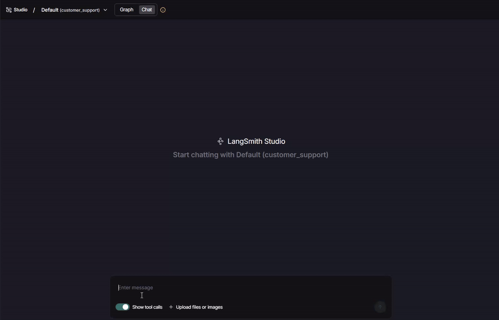

# ChatBaml: Custom LangChain Chat Model with BAML Integration

A project that extends a Custom LangChain Chat Model to integrate with BAML, creating a bridge between LangChain's powerful LLM orchestration capabilities and BAML's structured data extraction and function calling features.

Demo with 


**Status**: Active Development ⚠️

## 🚀 Quick Start with React Agent

### Installation

```bash
git clone https://github.com/thanhhuynhk17/ChatBaml.git
cd ChatBaml
uv venv
# source .venv/Scripts/activate  # Windows
source .venv/bin/activate # Linux/macOS
uv pip install -e .
```

### BAML Code Generation

```bash
# Auto-generate the baml_client directory with Python code to call your BAML functions
uv run baml-cli generate
```

### Environment Setup

Create a `.env` file with your API credentials:

```bash
OPENAI_MODEL_NAME="qwen3-vl"
OPENAI_BASE_URL="http://localhost:8000/v1"
OPENAI_API_KEY="sk_some_dummy_text"

# Set the default role in your .env when using an OpenAI-compatible server hosted by vLLM
DEFAULT_ROLE="user"
BAML_LOG=off # to disable Baml log

# Required for standardized content blocks in Langchain
LC_OUTPUT_VERSION="v1"
```

## 📋 React Agent Quick Start

### React Agent Implementation

```python
from langchain.agents import create_agent
from custom_langchain_model.llms.chat_baml import ChatBaml
from react_agent.tools import (
    add,
    multiply
)

import os
from dotenv import load_dotenv, find_dotenv
load_dotenv(find_dotenv())

chat_baml = ChatBaml(
    base_url=os.getenv("OPENAI_BASE_URL"),
    api_key=os.getenv("OPENAI_API_KEY"),
    model=os.getenv("OPENAI_MODEL_NAME"),
    streaming=True,
    temperature=0.7,
    
)

tools = [add, multiply]

agent = create_agent(
    chat_baml, 
    tools=tools,
    system_prompt="You are a helpful assistant.\n\n# Tools\n\nYou may call one or more functions to assist with the user query.",
)
```

### Available Tools
- **add**: Add two integers using Pydantic schema
- **multiply**: Multiply two integers using Pydantic schema

## 🚀 Key Features

### React Agent Integration
- **Easy setup**: Simple agent creation with streaming support
- **Tool integration**: Built-in support for Pydantic and LangChain tools
- **Streaming**: Real-time response streaming with proper content accumulation
- **Flexible**: Works with any LLM that supports structured instructions

### Streaming Support
- **Fixed streaming bug**: Proper content accumulation and tool call streaming
- **Content validation**: Monotonic growth validation and content discontinuity handling
- **Real-time responses**: Stream responses as they are generated
- **Tool support**: Handle tool calls during streaming

### Structure Output Enhancement
- BAML integration for structured output enhancement
- Automatic conversion of Pydantic BaseModel and LangChain `@tool` functions to BAML schemas
- Transparent BAML logging and debugging

### Tool Integration
- **Seamless schema generation**: Auto-convert Pydantic `BaseModel` and LangChain `@tool` decorators into BAML function schemas
- **LLM-agnostic tool calling**: Works with virtually any LLM — no native tool-calling support required (BAML handles orchestration). Only requires an LLM capable of following structured instructions for tool invocation.

## convert_to_baml_tool Usage

The `convert_to_baml_tool` function in `custom_langchain_model/helpers/parse_json_schema.py` automatically converts tools to BAML schemas.

### Supported Tool Types

#### 1. Pydantic BaseModel (Recommended)

```python
from pydantic import BaseModel, Field

class AddTool(BaseModel):
    """Use this tool when you need to add two integers."""
    a: int = Field(..., description="First integer to add")
    b: int = Field(..., description="Second integer to add")

class MultiplyTool(BaseModel):
    """Use this tool when you need to multiply two integers."""
    a: int = Field(..., description="First integer to multiply")
    b: int = Field(..., description="Second integer to multiply")
```

#### 2. LangChain @tool Decorated Functions

**Important**: `@tool` functions must use `@tool(parse_docstring=True)` and have well-documented docstrings with Args and Returns sections.

```python
from langchain.tools import tool

@tool(parse_docstring=True)
def count_words(text: str) -> int:
    """Count the number of words in the provided text.
    
    Counts words by splitting on whitespace. Returns the total number of words.
    
    Args:
        text (str): Input text to count words from.
    
    Returns:
        int: Number of words in the input text.
    """
    if text is None:
        return 0
    words = re.findall(r"\S+", text.strip())
    return len(words)
```

## Requirements

- Key dependencies:
  - `baml-py>=0.218.0`
  - `langchain>=1.0.0`
  - `langgraph>=1.0.0`
  - `pydantic>=2.12.3`
  - `pydantic-settings>=2.11.0`

## References

For more implementation details:

- **Original repository**: [tranngocphu/custom_langchain_chat_model](https://github.com/tranngocphu/custom_langchain_chat_model)
- **Connect to a custom model**: https://docs.langchain.com/langsmith/custom-endpoint
- **custom_chat_model.py from Langchain**: https://github.com/langchain-ai/langsmith-model-server/blob/main/app/custom_chat_model.py